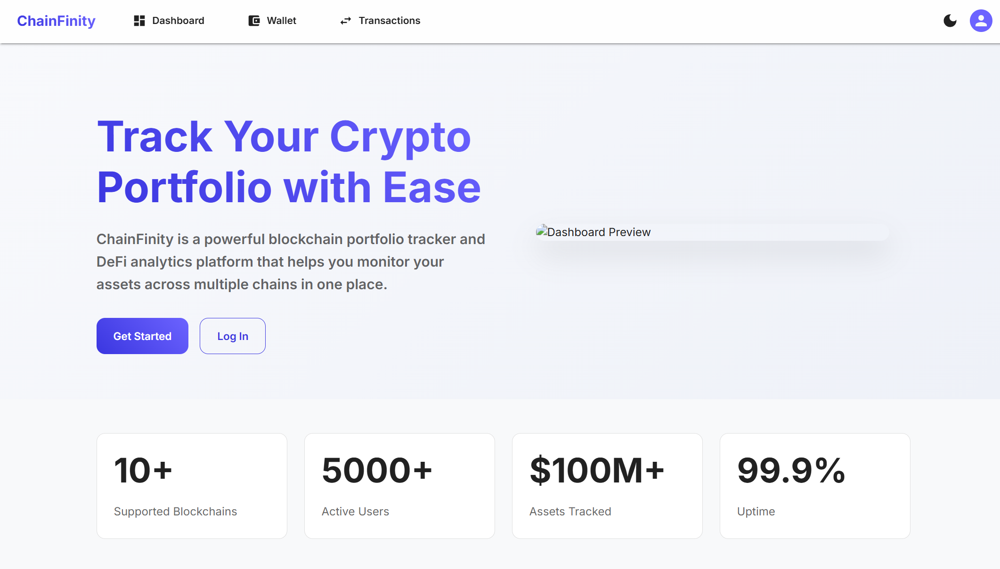

# ChainFinity


## Cross-Chain DeFi Risk Management Platform

ChainFinity is a full-stack cross-chain DeFi platform: a FastAPI backend that serves auth, users, portfolios, transactions, compliance, risk, and blockchain APIs, a React web dashboard, and a React Native (Expo) mobile app. Alongside the application is a set of Hardhat-managed Solidity contracts for cross-chain transfers, an asset vault, a lending-style protocol, and DAO governance, plus a small research library of machine-learning models for correlation, exploit, liquidity, and smart-money analysis.

<div align="center">
  
</div>

## Table of Contents

- [Overview](#overview)
- [Project Structure](#project-structure)
- [What Is Actually Implemented](#what-is-actually-implemented)
- [Technology Stack](#technology-stack)
- [Architecture](#architecture)
- [Installation and Setup](#installation-and-setup)
- [Running the Stack](#running-the-stack)
- [API Surface](#api-surface)
- [Testing](#testing)
- [CI/CD Pipeline](#cicd-pipeline)
- [Documentation](#documentation)
- [Contributing](#contributing)
- [License](#license)

## Overview

ChainFinity demonstrates a cross-chain DeFi risk workflow across a real, runnable codebase. The application tier (backend, smart contracts, and two clients) is fully wired and covered by tests. Alongside it sits a small research library of ML models: one (correlation and volatility) is wired into the live risk service, and the others (exploit detection, liquidity crisis, smart-money tracking) are tested but not yet connected to a live endpoint.

## Project Structure

```
ChainFinity/
├── code/
│   ├── backend/             # FastAPI service: API, auth, services, DB, infra
│   │   ├── app/             # FastAPI app, endpoints (v1 API)
│   │   ├── config/          # Settings and database config
│   │   ├── middleware/      # Auth, rate limit, security, logging, audit
│   │   ├── models/          # SQLAlchemy models
│   │   ├── services/        # Auth, portfolio, risk, market, compliance, blockchain
│   │   ├── migrations/      # Alembic migrations
│   │   ├── tests/           # Backend test suite
│   │   ├── docker-compose.yml
│   │   └── requirements.txt
│   ├── blockchain/          # Hardhat project
│   │   ├── contracts/       # AssetVault, CrossChainManager, DeFiProtocol, Governance
│   │   ├── test/            # Hardhat test suite
│   │   ├── scripts/         # Deploy scripts
│   │   └── subgraph/        # The Graph schema (not yet indexed)
│   └── ai_models/           # Research ML library
│       ├── train_correlation_model.py   # Wired into the risk service
│       ├── exploit_detection_model.py   # Library only
│       ├── liquidity_crisis_model.py    # Library only
│       └── smart_money_tracker.py       # Library only
├── web-frontend/            # React (Create React App) dashboard
├── mobile-frontend/         # React Native + Expo app
├── infrastructure/          # Docker, Kubernetes, Terraform, Ansible, monitoring
├── scripts/                 # Setup, test, deploy, and monitoring scripts
├── docs/                    # Documentation (this directory)
└── README.md
```

## What Is Actually Implemented

### Application tier (wired and tested)

- **API.** FastAPI backend exposing versioned endpoints under `/api/v1` for auth, users, portfolios, transactions, compliance, risk, and blockchain, plus a `/health` check.
- **Auth.** bcrypt password hashing, JWT access and refresh tokens, and an MFA setup flow. The signing key is read from `SECRET_KEY`, and the app refuses to start in production if it is left at the default value or is shorter than 32 characters.
- **Multi-source pricing.** Prices are aggregated across CoinGecko, CoinMarketCap, Binance, CryptoCompare, Alpha Vantage, and Yahoo Finance.
- **Correlation and volatility model.** A TensorFlow model backs the risk service's correlation and volatility estimates, with a deterministic mock predictor as a fallback when no trained model file is present, so the risk endpoints never hard-fail.
- **Data layer.** SQLAlchemy (async) over PostgreSQL, with Redis for caching and distributed rate limiting, and Alembic managing migrations.
- **Smart contracts.** Hardhat-managed Solidity 0.8.19 contracts: an asset vault, a Chainlink CCIP cross-chain manager with circuit breakers and rate limiting, a lending-style DeFi protocol with collateral-ratio and liquidation-threshold parameters, and an OpenZeppelin Governor plus timelock for token-weighted DAO voting.
- **Web dashboard.** React app covering Home, Dashboard, Portfolio, Transactions, Governance (with an analytics view), Settings, and authentication screens.
- **Mobile app.** React Native (Expo) app covering the same functional areas (dashboard, portfolio, transactions, governance, settings, authentication) through Expo Router's file-based navigation.
- **Guest login.** Both clients recognize a fixed demo credential (`guest@chainfinity.io` or `demo@chainfinity.io`) that creates a local session without calling the backend.

### Research tier (library modules)

- **Exploit detection.** Isolation Forest anomaly detection over transaction patterns.
- **Liquidity crisis model.** Statistical model for early liquidity-stress signals.
- **Smart money tracking.** K-means clustering over wallet activity to group similar behavior.

These modules are part of the codebase, unit-tested, and can be imported and run; unlike the correlation and volatility model, the backend does not currently call them from a live API route.

Not part of this project, despite appearing in earlier drafts of this document: automated hedging execution, flash loan defense, MEV protection, TimescaleDB, IPFS storage, live Chainlink price oracles (Chainlink here is used for CCIP messaging, not pricing), a live ArgoCD pipeline, and third-party KYC/AML providers (the hooks exist but currently point at stub endpoints).

## Technology Stack

| Area            | Technology                                                                                       |
| :-------------- | :----------------------------------------------------------------------------------------------- |
| Blockchain      | Solidity 0.8.19, OpenZeppelin v4, Chainlink CCIP, Hardhat                                        |
| Backend API     | Python 3.11+, FastAPI, Uvicorn, Pydantic v2                                                      |
| Auth            | bcrypt, PyJWT, an MFA (TOTP) service                                                             |
| Data layer      | SQLAlchemy 2 (async), Alembic, PostgreSQL, Redis                                                 |
| ML / Quant      | TensorFlow (correlation and volatility), scikit-learn (Isolation Forest, K-means)                |
| Market data     | CoinGecko, CoinMarketCap, Binance, CryptoCompare, Alpha Vantage, Yahoo Finance                   |
| Web frontend    | React 18, Create React App, Material-UI, TanStack Query, Ethers.js 6, Recharts                   |
| Mobile frontend | React Native, Expo, Expo Router, axios                                                           |
| Infrastructure  | Docker, Docker Compose, Kubernetes, Terraform (including an AWS EKS cluster), Ansible            |
| Monitoring      | Prometheus, Grafana, Alertmanager                                                                |
| CI/CD           | GitHub Actions                                                                                   |
| Testing         | pytest (backend), Hardhat (contracts), React Testing Library and Playwright (web), Jest (mobile) |

Not part of this project, despite being common in this space: TimescaleDB, IPFS, GraphQL (the subgraph schema exists but is not deployed or indexed), and ArgoCD.

## Architecture

ChainFinity is organized in tiers rather than a sprawl of microservices:

```
Clients
  ├── web-frontend (React)               ── HTTP/JSON ──┐
  └── mobile-frontend (React Native)     ── HTTP/JSON ──┤
                                                        ▼
Backend (FastAPI)
  ├── Endpoints (/api/v1/*)  auth, users, portfolios, transactions,
  │                          compliance, risk, blockchain
  ├── Middleware             security, CORS, trusted-host, rate limit (Redis),
  │                          auth, logging, audit
  ├── Services               portfolio, risk, market data, compliance, blockchain (web3.py)
  └── Data layer              PostgreSQL (async SQLAlchemy + Alembic), Redis
                                                        ▼
Blockchain (Hardhat / Solidity 0.8.19)
  AssetVault · CrossChainManager (Chainlink CCIP) · DeFiProtocol · Governance (Governor + Timelock)

Research library (code/ai_models)
  correlation & volatility (wired into the risk service, mock fallback if untrained)
  exploit detection · liquidity crisis · smart-money tracking (library only, unit-tested)
```

See [docs/ARCHITECTURE.md](docs/ARCHITECTURE.md) for detail.

## Installation and Setup

Prerequisites: Python 3.11+ and Node.js 18+. Docker is optional.

```bash
git clone https://github.com/quantsingularity/ChainFinity.git
cd ChainFinity

# Blockchain
cd code/blockchain
npm install

# Backend
cd ../backend
python -m venv .venv && source .venv/bin/activate
pip install -r requirements.txt

# Web frontend
cd ../../web-frontend
npm install

# Mobile frontend
cd ../mobile-frontend
npm install
```

Full, environment-specific instructions are in [docs/INSTALLATION.md](docs/INSTALLATION.md).

## Running the Stack

```bash
# 1) Supporting services (from infrastructure/, Docker required)
docker compose -f docker-compose.yml up -d postgres redis

# 2) Blockchain node (from code/blockchain)
npx hardhat node                # local chain at http://127.0.0.1:8545

# 3) Backend (from code/backend, venv active)
uvicorn app.main:app --reload   # serves http://0.0.0.0:8000, docs at /docs

# 4) Web dashboard (from web-frontend)
npm start                       # http://localhost:3000

# 5) Mobile app (from mobile-frontend)
npm start                       # press w for web, a for Android, i for iOS
```

The web dashboard reads its API base URL from `REACT_APP_API_URL` (default `http://localhost:8000`). The mobile app reads `EXPO_PUBLIC_API_URL` (same default).

See [docs/USAGE.md](docs/USAGE.md) and [docs/CONFIGURATION.md](docs/CONFIGURATION.md).

## API Surface

Base URL `http://localhost:8000`. Interactive docs at `/docs` (Swagger) and `/redoc`.

| Group        | Prefix                 | Highlights                                                                                |
| :----------- | :--------------------- | :---------------------------------------------------------------------------------------- |
| Health       | `/health`, `/`         | Liveness check                                                                            |
| Auth         | `/api/v1/auth`         | `login`, `refresh`, `logout`, `me`, `mfa/setup`                                           |
| Users        | `/api/v1/users`        | `me`, `me/profile`, `me/kyc`, `me/risk-profile`                                           |
| Portfolios   | `/api/v1/portfolios`   | list/create, `{id}`, `{id}/assets`                                                        |
| Transactions | `/api/v1/transactions` | list, `{id}`, `{id}/analyze`                                                              |
| Compliance   | `/api/v1/compliance`   | `checks`, `audit-logs`, `reports`, `suspicious-activities`                                |
| Risk         | `/api/v1/risk`         | `assess/{portfolio_id}`, `metrics/{portfolio_id}`, `stress-test/{portfolio_id}`, `alerts` |
| Blockchain   | `/api/v1/blockchain`   | `networks`, `contracts`, `events`, `balance/{address}`                                    |

Full request and response shapes are in [docs/API.md](docs/API.md).

## Testing

```bash
# Smart contracts (from code/blockchain)
npx hardhat test

# Backend (from code/backend)
pytest

# Web (from web-frontend)
npm test
npm run test:e2e     # Playwright end-to-end tests

# Mobile (from mobile-frontend)
npm test
```

The backend suite includes unit tests for auth and the web3 client, integration tests for the blockchain endpoints, and a dedicated `tests/test_ai_models.py` covering the correlation, exploit-detection, liquidity-crisis, and smart-money-tracking models. The Hardhat suite covers each Solidity contract individually.

## CI/CD Pipeline

GitHub Actions (`.github/workflows/cicd.yml`) runs five jobs on push, pull request, and manual dispatch:

| Job                          | Depends on          | What it does                                                                       |
| :--------------------------- | :------------------ | :--------------------------------------------------------------------------------- |
| Code Quality Checks          | -                   | Python formatter checks and a repository-wide Prettier check                       |
| Blockchain Compile & Test    | Code Quality Checks | Installs dependencies, compiles the Solidity contracts, and runs the Hardhat suite |
| Backend Tests                | Code Quality Checks | Runs the pytest suite with coverage and uploads the coverage report as an artifact |
| Web-Frontend Test & Build    | Code Quality Checks | Runs the frontend test suite and produces the production web build                 |
| Mobile-Frontend Test & Build | Code Quality Checks | Runs the Jest suite and produces the Expo web export                               |

## Documentation

| Document                                           | Contents                               |
| :------------------------------------------------- | :------------------------------------- |
| [docs/README.md](docs/README.md)                   | Documentation index                    |
| [docs/ARCHITECTURE.md](docs/ARCHITECTURE.md)       | System architecture                    |
| [docs/API.md](docs/API.md)                         | REST API reference                     |
| [docs/INSTALLATION.md](docs/INSTALLATION.md)       | Setup for all components               |
| [docs/CONFIGURATION.md](docs/CONFIGURATION.md)     | Environment variables and config       |
| [docs/USAGE.md](docs/USAGE.md)                     | Running and using the platform         |
| [docs/CLI.md](docs/CLI.md)                         | Helper scripts reference               |
| [docs/FEATURE_MATRIX.md](docs/FEATURE_MATRIX.md)   | Feature status, implemented vs planned |
| [docs/TROUBLESHOOTING.md](docs/TROUBLESHOOTING.md) | Common issues and fixes                |
| [docs/CONTRIBUTING.md](docs/CONTRIBUTING.md)       | Contribution guide                     |
| [docs/examples/](docs/examples/)                   | Worked examples                        |

## Contributing

See [docs/CONTRIBUTING.md](docs/CONTRIBUTING.md).

## License

This project is licensed under the MIT License - see the [LICENSE](LICENSE) file for details.
